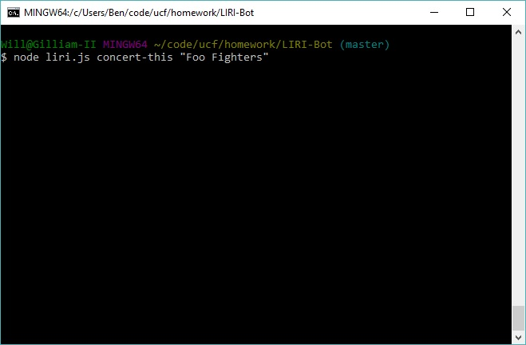
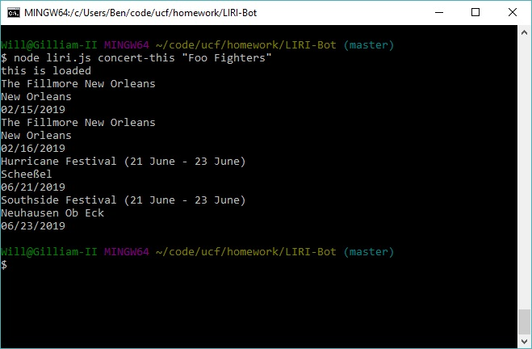
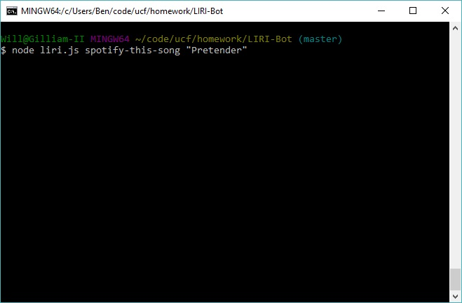
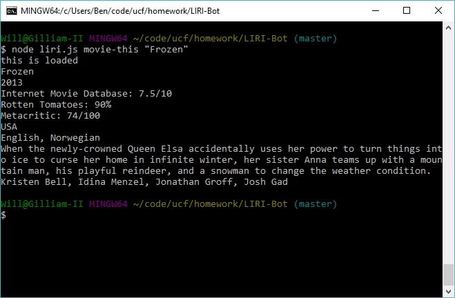
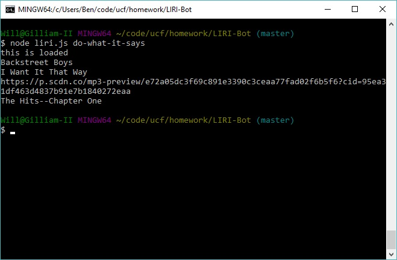
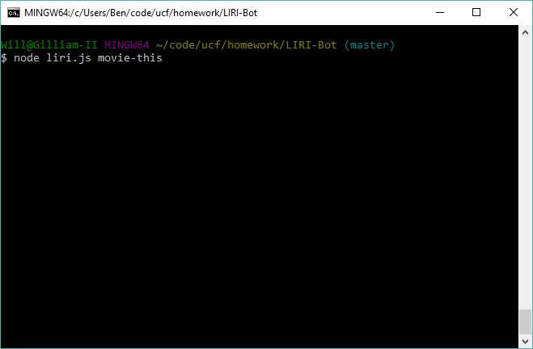
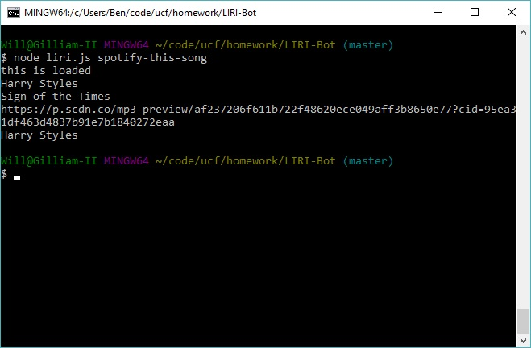
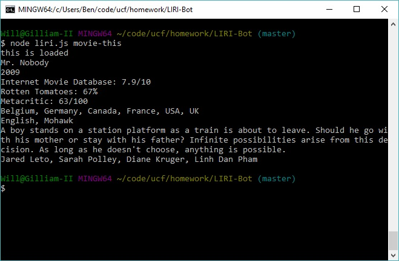

# LIRI-Bot
### This is a command line node app that takes in parameters and gives you back data.
#### Usage
* When a user opens the app, they will input a command from the following list of commands:
    1. node liri.js concert-this "Name-of-Band"

    
    
    Which will display the venue, city, and date of each concert on the current tour of the specified band.

    

    1. node liri.js spotify-this-song "Name-of-Song"

    
    
    Which will display the artist, song title, sample url, and album name of the specified song.

    

    1. node liri.js movie-this "Name-of-Movie"

    
    
    Which will display the title, year of release, IMDB rating, Metacritic rating, country, language(s), a brief synopsis, and a list of the top-billed cast.

    

    1. node liri.js do-what-it-says

    

  Which will cause the app to read and run the command(s) in the random.txt file.

    

* If you do not specify a song or movie for the "spotify-this-song" and "movie-this" commands:

    
    

  There is a default search that will run.

    
    

#### Purpose
* LIRI-Bot demonstrates usage and understanding elements of node.js including exports, require, and argv.
## Will Houston designed, styled, and coded this project.